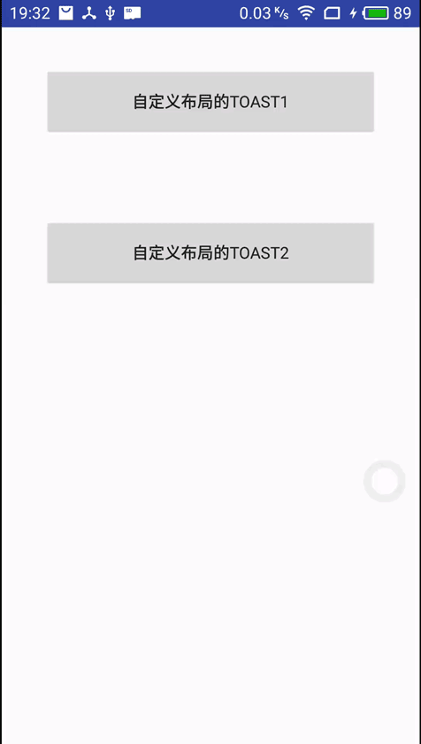

# NiceToast
一个针对Android Toast 封装的库，添加显示位置、
显示时长、背景等(支持自定义视图)、支持返回键取消、支持点击事件。
## 效果图




## 简单使用
```
      NiceToast.make(context)
               .text("普通Toast")
               .show();
 ```

更多使用方式及效果请参考demo中的代码示例
## 引入
```
      implementation 'com.zcy:nicetoast:1.1.0'
```
      
